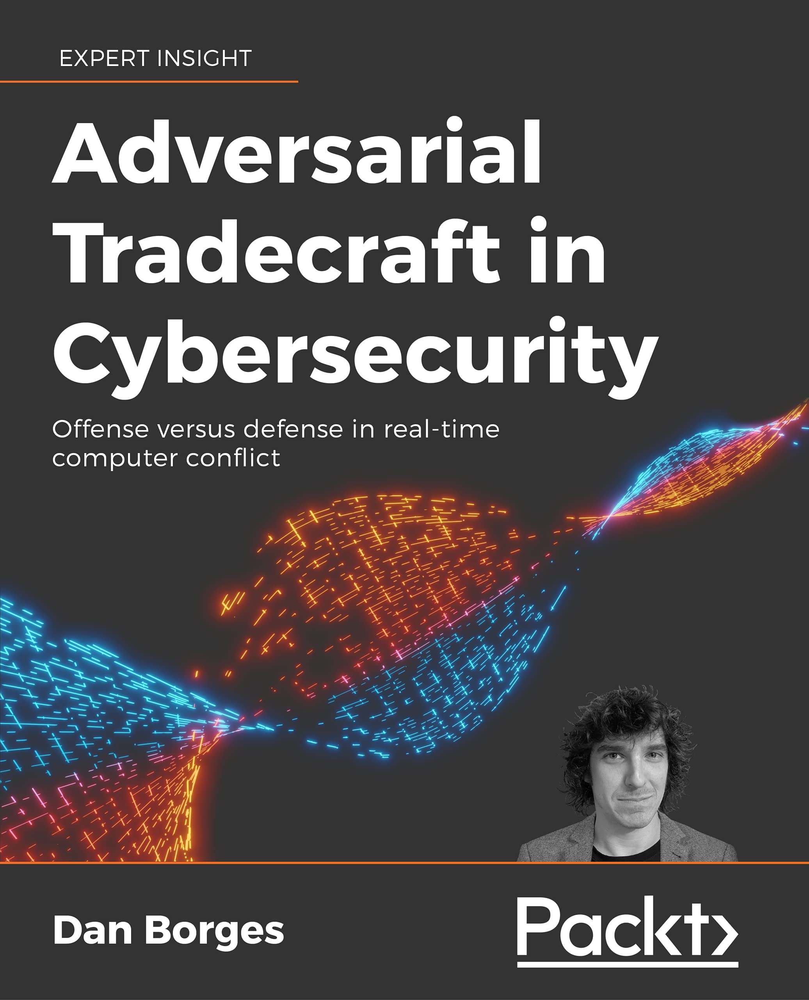

# Hello Hackers

## Things done
- Finished book
- Published book
- You can order the book [here](https://www.amazon.com/Adversarial-Tradecraft-Cybersecurity-real-time-computer-ebook/dp/B0957LV496/)
- You can checkout the [supporting code here](https://github.com/ahhh/Cybersecurity-Tradecraft)
- Some awesome reviews:
- - 
- - [BreakSec Interview Part 1](https://brakeingsecurity.com/2021-024-dan-borges-author-of-adversarial-techniquees-from-packt-publishing)
- - [BreakSec Interview Part 2](https://brakeingsecurity.com/2021-025-dan-borges-author-of-adversarial-techniques-from-packt-publishing)
- - 
- - [Dr. Chase Cunningham Approves](https://www.linkedin.com/feed/update/urn:li:share:6818204517738270720)

## Things to do
- Have more people review the book!
